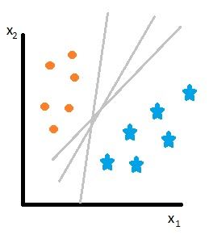

\newpage

\chapter{Non-Parametric Regression}

## Setup

$$\left(y, \underline{x} \right) \sim p\left(y,\x\right)$$
$$\mathcal{R}\left(g\right)=\expvalue{y-g\left(\x\right)}$$
$$g^*\left(\underline{x}\right) = \argmin_{g} \mathcal{R}\left(g\right) = \expvalue{y|\x=x}$$

The target in this case is the regression function.

In general, our target $g^*(.)$ is a complex function of $\x$.

The parameter we're trying to estimate live in a complicated parameter space $\mathcal{F}$. That's just some sort of function's space (plus some smoothness).

To get good predictions, we need to estimate well $g^*(.)$ that is a point in some well-behaved function space.

## Methods

1. Orthogonal expansions.
    - Linear regression in high-dim.
1. Local average.
    - Kernel methods. Local Poly. K-nn.
1. Kernel methods (The other kernel)
    - Ridge regression.

## Orthogonal expansion in hilbert spaces

### Vector spaces

\newpage

# Splines

We need to represent a function $g:\left[a,b\right] \rightarrow \mathbb{R}$.

## Informally

A piecewise polynomial plus smoothness constraints on the joints.

Image 1

## Definition: k-order spline

A function $f: \mathbb{R} \rightarrow \mathbb{R}$ is a **k-order** spline relative to the knot set $\left\{t_1, t_2, ... , t_n \right\}$ iff $f(.)$ is a polynomial of order $k$ on each interval $\left(-\infty, t_1\right], \left(t_1, t_2\right], ..., \left(t_{m-1}, t_m\right], \left(t_m, \infty \right)$ and $f^{\left(j\right)}\left(.\right)$\footnote{j-th derivative} is continous at the knots for each $j \in \left\{0,1,...,k-1\right\}$.

1. Comment

    Linear an cubic splines are the famous ones.

Imagine that you pick the space of $k$-order splines on a arbitrary set on knots as parameter space where to search for an estimator of our regression function $\Rightarrow$ we need a set of function (basis) to generate this space.

$\left\{\phi_1(x), \phi_2(x), \dots \right\}$ such that each time we take linear combinations of these functions we get back a $k$-th order spline over some set of knots.

## Options

1. A simple one: Truncated power basis.

    $\phi_1\left(x\right) = 1$ $\phi_2\left(x\right) = x$ $\phi_3\left(x\right) = x^2$ ... $\phi_{k+1}\left(x\right) = x^k$ therefore $\phi_{k+1+j}\left(x\right) = \left(x-t_j\right)_{+}^k$ for $j \in \left\{1, \dots, m\right\}$\footnote{Remember $\left(x\right)_{+} = \displaystyle \max\left(0,x\right)$}
    
    * Any $k$-order spline on $\left\{t_1, \dots, t_m \right\}$  can be represented as a linear combination appropriate Truncated Power Basis.
    * This representation is usually unstable... we can do better: **Natural Spline**.
    
    Represent our unknown function $g\left(.\right)$ in TPB. \[g(x)=\sum_{j=1}^{k+1+m} \alpha_j \phi_j\left(x\right)\]\footnote{$\phi_j\left(x\right)$ TBT not ortho base}.
    
    Now we have data $\left\{\left(y_i, x_i\right)\right\}_{i=1}^n$. So let, $\Phi=\left[\phi_j\left(x_i\right)\right]_{ij}$ of size $n$ x $k+1+m$ not orthogonal design matrix. $\Rightarrow$ for $k$ and $\left\{t_1, \dots, t_m\right\}$ **fixed** (but actually we have to choose them base on data) we are back to linear regression. Meaning that we can estimate $\alpha \in \mathbb{R}^{k+1+m}$ as \[\hat{\alpha} = argmin_{\alpha \in \mathbb{R}^{k+1+m}} ||y-\Phi_m\alpha ||\]
    
    **Every alpha and y with piso**
    
    Therefore via OLS, $\hat{\alpha} = \left(\Phi^{T}\Phi\right)^{-1}\Phi^Ty$
    
    Perfectly fine problem if we choose the number of knots $m$ their position and the spline order $k$ appropriatly.     
    Tuning parameters in regression splines are:
    
    * $m$: # knots.
    * $t_1, \dots, t_m$: Knots position.
    * $k$: spline order. 
    
    This is called REDUCED RANK REGRESSION.
    
    For example,
    
    - The higher $k$ the more flexible the spline the higher its variance as an estimator.
    - Same for $m$
    - Knots position: You'd like to habe more knots... where the true function is more complex/wiggly.
    
    image 2
    
    **Typical choices**
    
    - $k=3$
    - $m \rightarrow$ GCV.
    - The knots are placed on suitable quantities of the x's.
    
    **Other choices**
    
    - Adaptive or free knots splines $\rightarrow$ try to optimize the position and numbers of the knots. ($k$ fixed$). Negative side: time consuming to be solved by optimization or bayesian reasoning (MCMC)

# Support Vector Machines

SVM are in general linear classifiers. We obtain them as a penalized hinged-loss problem. 

## The End

$y_i \in \left\{-1,1\right\}$ 

We want to find a linear classifier $h(\underline{x}) = sign\left(H_{\beta}(\underline{x})\right)$ then $H_{\beta}(\underline{x}) = \underline{x}^T\beta$ \footnote{poner underline en beta y x} 

\[\hat{\beta}= argmin_{all \text{ } \beta} \sum_{i=1}^n\left[1-y_iH_{\beta}(\underline{x})\right]_{+} + \lambda ||\beta||_2^2\]

## The beginning

### Geometrical construction/motivation

With $k=2$. 

Exist at least one hyperplane that perfectly separates our two classes.

We need to pick the optimal one and we gonna do that taking the one that brings the LARGEST MARGIN between the two classes

Image 2

Signed from the boundary of each data point.

*Decision boundary*

$\left\{\underline{x} \in \mathbb{R}^k / H_{\beta}(\underline{x}) =0 \right\}$

### Geometry 101

$H_{\beta}(\underline{x}) = \beta_0+\underline{x}^T \beta$

$\underline{x}, \underline{x}' \in P \rightarrow \underline{x}-\underline{x}'\in P$

We want $<n, \underline{x}-\underline{x}'>=0 \rightarrow \underline{x}^Tn=c \rightarrow n=\beta \rightarrow n=\frac{\beta}{||\beta||}_2$

$w = \underline{x}^0-\underline{x}'$ then $cos\left(\theta\right) = \displaystyle \frac{d}{||w||_2}$

$\frac{||n||_2}{||n||_2} ||w||_2 cos\left(\theta\right) = d$

$cos\left(\theta\right) = \frac{<n,w>}{||n||_2||w||_2}$

Finally,

$d = \frac{<n,w>}{||n||_2} \rightarrow d = \frac{H_{\beta}(\underline{x}_0)}{||\beta||_2}$

The signed distance of any point $\underline{x}_0$ from the plane $H_{\beta}(\underline{x})$ is equal to: \[\frac{H_{\beta}(\underline{x}_0)}{||\beta||_0}\] Assume that $H_{\beta}(\underline{x})$ is any separating hyperplane the $y_i$ and $H_{\beta}(\underline{x}_i)$ have the same sign so the distance of any datapoint $\underline{x}_i$  from the boundary then is equal to $\frac{y_iH_{\beta}(\underline{x}_i)}{||\beta||_2}$ 

This leads to the following optimization problem to choose the largest margin.

Cases

$\displaystyle \max_{\beta_0, \beta} M$ s.t $\frac{y_iH_{\beta}(\underline{x}_i)}{||\beta||_2} \geq M, \forall i \in \left\{1, \dots, n\right\}$

By a scaling argument

$\displaystyle \min_{\beta_0, \beta} ||\beta||_2$ s.t $\frac{y_iH_{\beta}(\underline{x}_i)}{||\beta||_2} \geq 1, \forall i \in \left\{1, \dots, n\right\}$

*Remarks*

1. Quadratic optimization problem (Quadratic object function with linear constraints).
1. Standard techniques from convex optimization to solve it.

Once we have a constrained optimization problem, usually we go "lagrangian".

### Primal Langrangian

$\displaystyle \min_{\beta_0, \beta} \frac{1}{2}||\beta||_2^2 + \sum_{i=1}^n \gamma_i \left[1-y_i H_\beta\left(x_i\right)\right]$ s.t
$\gamma_i \geq 0, i \in \left\{1, \dots, n\right\}$

Differentiate the PL to get the KKT optimality condition over $\beta$ and $\gamma$.

We have that:

1. $\beta = \sum_{i=1}^n \gamma_i y_i x_i = \sum_{i=1}^n \alpha_i x_i$
1. $\sum_{i=1}^n \gamma_i y_i = 0$ we name $\alpha_i = \gamma_i y_i$

Remember $\gamma_i \geq 0$ and $y_i \in \{-1,1\}$ then for the sum to be equal to zero... some of the $\alpha_i = 0$ and if $y$ is the set of active vector or support vector having $\alpha_i \neq 0$ then $\beta = \sum_{i \in y} \alpha_i x_i$

For computational reasons it is usually better (more efficient) to solve the dual lagrangangian. You get it inserting the optimal solution I wrote before into the primal. \[\beta = \sum_i \gamma_i y_ix_i\]

Then we want to: $\displaystyle \max_{\gamma_1, \dots, \gamma_n} \sum_{i=1}^n \gamma_i - \frac{1}{2}\sum_{i=1}^n\sum_{j=1}^n \gamma_i \gamma_j \left(y_i y_j\right)\left(x_i^T x_i\right)$ with $\gamma_i \geq 0, \forall i \in \{1, \dots, n\}, \sum_{i=1}^n \gamma_i y_i$

1. $n < k$
1. It depends only on $<\underline{x}_i, \underline{x}_j>_{\mathbb{R}^k}$

### Moving from linearly separable to non linearly separable case

Soft-margin: 

$\displaystyle \min_{\beta_0, \beta} ||\beta||_2$ s.t $\frac{y_iH_{\beta}(\underline{x}_i)}{||\beta||_2} \geq 1, \forall i \in \left\{1, \dots, n\right\}$

We want to allow some violations. In optimization you just augment the original problem with as many slacks (variables) as needed to soften the constraints. 

$\displaystyle \min_{\beta_0, \beta} ||\beta||_2$ s.t $\frac{y_iH_{\beta}(\underline{x}_i)}{||\beta||_2} \geq 1-\epsilon_i, \forall i \in \left\{1, \dots, n\right\}, \epsilon_i \geq 0 \forall \in \left\{1, \dots, n\right\}, \sum_{i=1}^n \epsilon_i \leq B$

1. B (overal budget to account for violations) becomes a tuning parameter.
1. The solution to this relaxed problem has the same structure as before $\beta = \sum_{i \in y } \alpha_i x_i$ but now $y$ is the support set = $support vectors \cup violators$
1. If $B$ is larger we get more stable solutions (involving a larger support set) and lower variance.
1. We need $\epsilon_i > 0$ when our margin is less than 1 an we change by an amount equal to the sum of the slacks \[\sum_{i=1}^n \left[1-y_iH_\beta\left(x_i\right)\right]_{+} \leq B\]

$\displaystyle \min_{\beta_0, \beta} ||\beta||_2$ s.t $\sum_{i=1}^n \left[1-y_iH_\beta\left(x_i\right)\right]_{+} \leq B$

Finally,

\[\displaystyle \min_{\beta} ||\beta||_2^2 +\gamma \sum\left[ derivar \right]_{+}, \lambda = \frac{1}{\gamma}\]

\begin{appendices}
\chapter{Hilbert spaces}
\chapter{Convex and concave funcions}
\chapter{Norms}
\chapter{Gradients}
\chapter{Mathematical programming}
\end{appendices}
